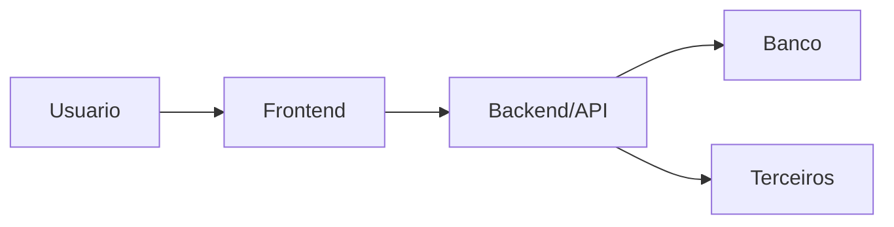
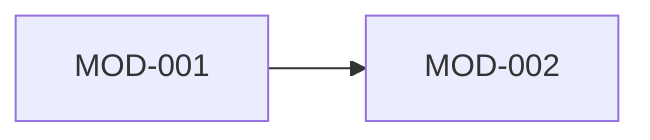

# ARCHITECTURE - [NOME DO REPO/AMBIENTE]

> Planta tecnica deste repo/ambiente. Segue `A_Architecture/A_Method_PlantaTecnica.md`:
> especifica, derivada do codigo, verificavel e enxuta. Uma planta por repo/ambiente.
> Este documento e exclusivamente AS-IS. Toda intencao fica em
> `TARGET_ARCHITECTURE.md` + ADR.

**Fonte:** analise direta do codigo
**Data da analise:** YYYY-MM-DD
**Horizonte:** AS-IS
**Status:** DERIVADA_DO_CODIGO | DRIFT_PARCIAL | DESATUALIZADA
**Decisoes relacionadas:** ADR-
**Specs relacionadas:**

Regra de manutencao: mudanca estrutural (rota, tabela, integracao, camada, lib,
modulo novo) atualiza esta planta no mesmo PR/ciclo. Secao que virar promessa vai
para `TARGET_ARCHITECTURE.md` ou sai; promessa nunca permanece no AS-IS.

## 1. Stack Real

| Camada | Tecnologia | Versao (do manifest) |
|---|---|---|
| Runtime |  |  |
| Framework |  |  |
| Banco/ORM |  |  |
| Auth |  |  |
| Testes |  |  |

**NAO existem no projeto** (nao usar sem ADR; corrige docs antigos que citem):

- ...

## 2. Visao Geral E Fluxo De Referencia



**Fluxo de uma feature de referencia, camada a camada, arquivo por arquivo**
(o molde que toda feature nova replica):

1. `caminho/arquivo` - papel no fluxo
2. `caminho/arquivo` - papel no fluxo
3. `caminho/arquivo` - papel no fluxo

## 3. Modelo De Dominio

| Entidade | Papel | Relacoes/FKs | Quirks de tipo |
|---|---|---|---|
|  |  |  |  |

## 4. Estrutura Real De Pastas

```text
src/
  ...
```

**Padrao interno de cada modulo de dominio:**

- ...

**Pastas vazias/reservadas:** marcar como `VAZIO - nao usar sem ADR`.

## 5. Contratos De API

| Rota | Metodo | Auth | Papel/role |
|---|---|---|---|
|  |  |  |  |

**Convencoes de serializacao:** (ex.: opcionais como null -> zod `.nullish()`)

## 6. Autenticacao E Autorizacao

- Mecanismo de auth/sessao:
- Roles e permissoes:
- Assinatura/verificacao de webhooks:

## 7. Regras De Camada

| Regra | Gate que a cobra |
|---|---|
| Quem pode importar quem |  |
| Onde vive regra de negocio |  |
| O que rota/handler NAO faz |  |

Regra sem gate (lint, CI, teste ou checklist de review) e letra morta: definir o
gate ou mover para Gaps.

## 8. Gerenciamento De Estado (frontends)

| Tipo de estado | Onde vive |
|---|---|
| Inicial |  |
| Server state |  |
| UI local |  |
| Global |  |

**Proibicoes explicitas:** (ex.: nunca duas libs de estado global; nunca
useEffect+fetch em fluxo principal)

## 9. Requisitos Minimos De Plataforma

- Roda em celular? Resolucao minima:
- Idioma(s):
- Temas (claro/escuro):
- Offline:
- Acessibilidade:

## 10. Escalabilidade E Cache

Estrategia de cache conforme `P_Performance/P_Method_CacheStrategy.md`.

- Stateless backend:
- Filas:
- Cache (camadas, chaves, invalidacao):
- Paginacao:
- Rate limits:
- Idempotencia:
- Concorrencia:

## 11. Gaps E Pontos De Atencao

| Gap | Severidade | Acao/dono |
|---|---|---|
|  | ALTA/MEDIA/BAIXA |  |

Debito tecnico honesto e visivel. Camada planejada e nao implementada e Gap
declarado, nunca descricao no presente.

## 12. Catalogo Modular Observado

Segue `A_Architecture/A_Method_ModularArchitecture.md`.

| ID | Modulo real | Responsabilidade | API publica | Dados/owner | Invariantes | Dono |
|---|---|---|---|---|---|---|
| MOD-001 |  |  | CON-001 |  | INV-001 |  |

### Dependencias Observadas

| Origem | Destino | Tipo | Evidencia | Estado |
|---|---|---|---|---|
| MOD- | MOD- | build/sync/async | arquivo:simbolo | PERMITIDA/PROIBIDA/GAP |



**Ciclos observados:** nenhum | [ciclo + evidencia + gap]

## 13. Transacoes, Consistencia E Eventos Observados

| Fluxo | Limite transacional | Consistencia | Evento/efeito | Idempotencia/retry | Evidencia |
|---|---|---|---|---|---|
|  | MOD- | forte/eventual | EVT- |  | arquivo:simbolo |

## 14. Patterns Observados

Referencia normativa: `PATTERN_MAP.md`, conforme
`A_Architecture/A_Method_PatternMap.md`.

| Pattern | Presenca | Decisao normativa | Evidencia | ADR/gate |
|---|---|---|---|---|
| PAT-001 | OBSERVADO/PARCIAL | SEM_DECISAO/APROVADO/DEPRECIADO/PROIBIDO | arquivo:simbolo | ADR-/gate |
