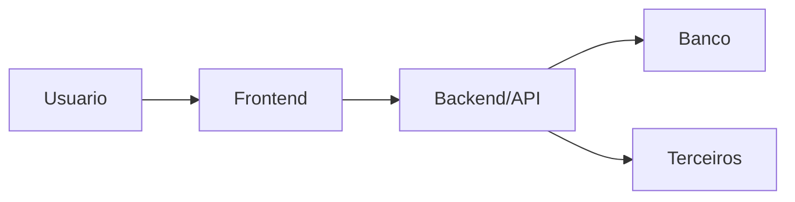

# ARCHITECTURE - [NOME DO PROJETO]

## Contexto

**Objetivo arquitetural:**  
**Decisoes relacionadas:** ADR-  
**Specs relacionadas:**  

## Fronteiras

| Camada | Responsabilidade | Nao faz |
|---|---|---|
| Frontend |  |  |
| Backend/API |  |  |
| Banco |  |  |
| Workers/Jobs |  |  |
| Terceiros |  |  |

## Modulos

| Modulo | Responsabilidade | Contratos | Dono |
|---|---|---|---|
|  |  |  |  |

## Fluxos Criticos

### [Fluxo]

1.  
2.  
3.  

**Riscos:**  
**Rollback:**  
**Observabilidade:**  

## Escalabilidade Horizontal

- Stateless backend:
- Filas:
- Cache:
- Paginacao:
- Rate limits:
- Idempotencia:
- Concorrencia:

## Diagramas

## Lacunas

- [ ]  
