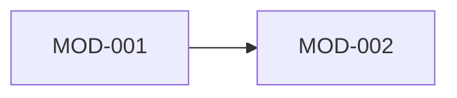

# TARGET_ARCHITECTURE - [NOME DO REPO/AMBIENTE]

> Arquitetura TO-BE. Em `RASCUNHO`, descreve proposta rastreada a spec e decisoes
> pendentes; em `APROVADO` ou posterior, descreve somente alvo aceito. O estado
> atual permanece em `ARCHITECTURE.md`.

**Horizonte:** TO-BE
**Data:** YYYY-MM-DD
**Spec(s) de origem e estado:** SPEC- / REQ- / NFR- | DRAFT/READY_FOR_ARCH/READY_FOR_BREAKDOWN
**ADR(s) aplicaveis:** ADR- | N/A - nenhuma decisao material com trade-off
**AS-IS de referencia:** `ARCHITECTURE.md` analisado em YYYY-MM-DD | N/A - greenfield sem codigo observavel
**Dono:** @A / [time]
**Estado:** RASCUNHO | APROVADO | EM_TRANSICAO | ATINGIDO | SUBSTITUIDO

## 1. Objetivo E Drivers

- Problema:
- Drivers de produto:
- NFRs:
- Restricoes:
- Fora de escopo:

## 2. Delta AS-IS -> TO-BE

| ID | AS-IS observado | TO-BE desejado | Motivo | Spec/ADR aplicavel | Task de transicao |
|---|---|---|---|---|---|
| DELTA-001 |  |  |  | REQ- / ADR- ou N/A justificado | TASK- |

## 3. Catalogo Alvo De Modulos

| ID | Modulo | Responsabilidade | API publica | Dados/owner | Invariantes | Dono |
|---|---|---|---|---|---|---|
| MOD-001 |  |  | CON-001 |  | INV-001 |  |

## 4. APIs Publicas, Contratos E Eventos

| ID | Tipo/protocolo | Operacao/rota/topico | Produtor/owner | Consumidor | Entrada/saida/schema | Erros/semantica | AuthN/AuthZ | Versao/depreciacao | Idempotencia/deduplicacao | Compatibilidade | Gate |
|---|---|---|---|---|---|---|---|---|---|---|---|
| CON-001 | HTTP/gRPC/job/webhook |  |  |  |  |  |  |  |  |  |  |
| EVT-001 | evento/schema |  |  |  |  |  | N/A justificado |  |  |  |  |

## 5. Ownership De Dados E Invariantes

| Dado/entidade | Modulo owner | Escritores permitidos | Leitores | Invariantes | Gate |
|---|---|---|---|---|---|
|  | MOD- |  |  | INV- |  |

## 6. Dependencias

### Permitidas

| Origem | Destino | Tipo | Motivo | Gate |
|---|---|---|---|---|
| MOD- | MOD- | sync/async/build |  |  |

### Proibidas

| Origem | Destino | Regra | Motivo | Gate bloqueante |
|---|---|---|---|---|
| MOD- |  |  |  |  |

## 7. Grafo E Ciclos

- Ciclos permitidos: nenhum | [ADR + justificativa]
- Gate de deteccao:

## 8. Transacoes, Consistencia E Eventos

| Fluxo | Limite transacional | Consistencia | Evento/efeito | Ordenacao | Idempotencia/retry | DLQ/replay | Compensacao/reconciliacao |
|---|---|---|---|---|---|---|---|
|  | MOD- | forte/eventual | EVT- |  |  |  |  |

## 9. Patterns

Referencia: `PATTERN_MAP.md`.

| Pattern | Presenca alvo | Decisao atual | Decisao alvo | Modulos | ADR | Gate |
|---|---|---|---|---|---|---|
| PAT-001 | PRESENTE/AUSENTE | SEM_DECISAO/PROPOSTO/APROVADO/DESCARTADO/DEPRECIADO/PROIBIDO | PROPOSTO/APROVADO/DESCARTADO/DEPRECIADO/PROIBIDO | MOD- | ADR-/N/A justificado |  |

Em `RASCUNHO`, use `Decisao atual = PROPOSTO` e registre a decisao alvo sem
trata-la como vigente. Em `APROVADO`, a decisao atual deve refletir o alvo aceito.

## 10. Evolucao, Rollout E Rollback

| Etapa | Mudanca | Compatibilidade | Rollout/smoke | Abort criterion | Rollback/forward-fix |
|---:|---|---|---|---|---|
| 1 |  |  |  |  |  |

- Estrategia expand/migrate/contract:
- Feature flags/adapters temporarios:
- Backfill/replay/reconciliacao:
- Remocao do caminho legado:

## 11. Fitness Gates

| Gate | Comando/regra | Frequencia | Evidencia | Resultado bloqueante | Dono |
|---|---|---|---|---|---|
| FIT-001 |  | PR/CI/release | EVD- |  |  |

## 12. Rastreabilidade

| Requisito | Modulo/contrato | ADR | Task | Teste | Evidencia |
|---|---|---|---|---|---|
| REQ-/AC-/NFR- | MOD-/CON-/EVT- | ADR- | TASK- | TEST- | EVD- |

## 13. Lacunas E Decisoes Pendentes

| ID | Lacuna | Impacto | Dono | Prazo | Bloqueia? |
|---|---|---|---|---|---|
| GAP-001 |  |  |  |  | SIM/NAO |
